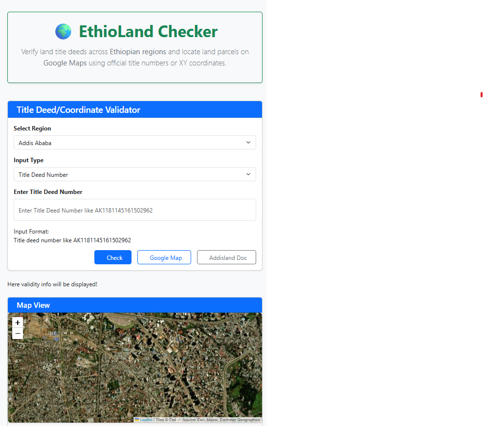

# EthioLand Checker - Help Documentation

## Overview
EthioLand Checker is a web application designed to help users verify land title deeds across Ethiopian regions and locate land parcels on Google Maps using official title numbers or XY coordinates.

---

## Main Features

### 1. Title Deed/Coordinate Validator
- **Purpose**: Verify the validity of land title deeds or coordinates.
- **Components**:
  - **Select Region**: Choose the Ethiopian region (e.g., Addis Ababa) where the land is located.
  - **Input Type**: Toggle between "Title Deed Number" and "XY Coordinates" for validation. For now only Addis Ababa region supports digital title deeds. For other regions just put the XY coordinates in the require format. 
  - **Input Field**: Enter the title deed number (e.g., `AK1181145161502962`) or XY coordinates based on the selected input type.
  - **Check Button**: Click to validate the entered information.

### 2. Google Map Integration
- **Purpose**: Visualize the land parcel location on Google Maps.
- **Features**:
  - Displays the land parcel based on the validated title deed or coordinates.
  - Interactive map with zoom and pan functionality.
    
### 3. Map View
- **Purpose**: Provides a geographical representation of the land parcel.
- **Note**: The map data is sourced from "East, Maker, Ethiopian Geographies" and may have limitations in certain regions.
- 
### 4. Addisland Doc (For Addis Ababa Region)
- **Purpose**: Open the PDF vesion of the digital title deed from the official Addisland website which shows detailed information.
- **Output**: A new tab is opened with the digital pdf version of the title deed.

---

## Step-by-Step Usage Guide

### Step 1: Select the Region
- Click the dropdown under **"Select Region"** and choose the region where the land is located (e.g., Addis Ababa).

### Step 2: Choose Input Type
- Select either **"Title Deed Number"** or **"XY Coordinates"** from the **"Input Type"** dropdown.

### Step 3: Enter the Required Information
- **For Title Deed Number**:
  - Enter the title deed number in the format specified (e.g., `AK1181145161502962`).
- **For XY Coordinates**:
  - Enter the latitude and longitude values (format [x1,y1; x2,y2;]).

### Step 4: Validate the Information
- Click the **"Check"** button to verify the entered data.
- The results will be displayed as Valid or Invalid.

### Step 5: View on Google Maps
- After validation, the land parcel will be highlighted on the **Google Map** section.
- Use the map controls to zoom in/out or pan for better viewing.
- Clicking on the **"Google Map"** button opens the location on Google Map app (website).

---

## Input Format Guidelines

### Title Deed Number
- Format: `AK1181145161502962` (example).
- Ensure the number matches the official title deed format for the selected region.

### XY Coordinates
- Format: Depends on the application's requirements (e.g., decimal degrees or degrees-minutes-seconds).
- Example: `9.0056° N, 38.7636° E`.

---

## Troubleshooting

### Common Issues
1. **Invalid Title Deed Number**:
   - Ensure the number is entered correctly without spaces or special characters.
   - Verify that the region selected matches the title deed's issuing region.

2. **Map Not Displaying**:
   - Check your internet connection.
   - Ensure the coordinates or title deed number are valid and correctly formatted.

3. **No Validity Info Displayed**:
   - Confirm that the **"Check"** button was clicked after entering the details.
   - Contact support if the issue persists.

---

## Support
For further assistance, please contact:
- **Email**: support@ethiolandchecker.com
- **Phone**: +251 XXX XXX XXX

---

## Disclaimer
- The information provided by EthioLand Checker is for reference only. For official land records, consult the relevant Ethiopian land administration authorities.
- Map data may be incomplete or outdated in some regions.
